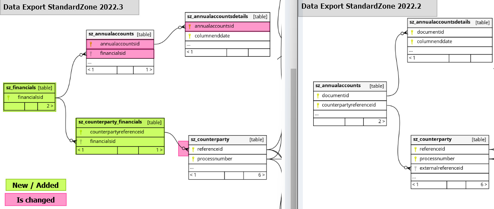

Changelog FDA Standard Zone version from 2022.2 to 2022.3:

* Foreignkey constraint 'sz_counterparty'
  * Removed FK on 'externalreferenceid' 
  * Add FK on 'referenceid' 

* Changes in table 'sz_annualaccountsdetails'
  * renamed 'documentid' to 'annualaccountsid'

* Changes in table 'sz_annualaccounts'
  * renamed 'documentid' to 'annualaccountsid'
  * renamed 'counterpartyreferenceid' to 'financialsid'
  
* added extra table 'sz_financials'
  * Column 'financialsid' is used as many-to-many relation
  
* added extra table 'sz_counterparty_financials'
  * Table is used to connect data from Fyndoo Lending to Fyndoo Financials
  * Column 'counterpartyreferenceid' is primarykey
  * Column 'financialsid' is the reference to data in Fyndoo Financials
  * Column 'financialsid' can be empty, when no data is available for the counterparty in Fyndoo Financials
  * Column 'financialsid' has no unique constraint, so multiple counterpartyreferenceid can be linked to the same financialsid

* visualisation of the changes

Note: 
Since 02-05-2023 all ‘old’ data exports (2022.x) will use this ‘referenceid_old’ and   ‘businessrulereferenceid_old’. This is a ID with the property (varchar16) and is filled with ‘row_number()’, because all referenceid are filled with a UUID and the old ids are also converted to an UUID.
All ‘new’ data exports (>= 2023.x) will use referenceid (UUID). This is a ID with the property (varchar128)

	